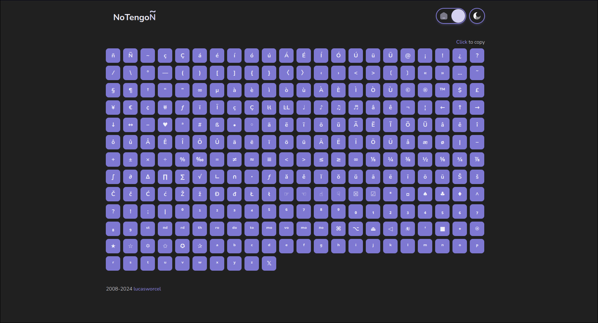
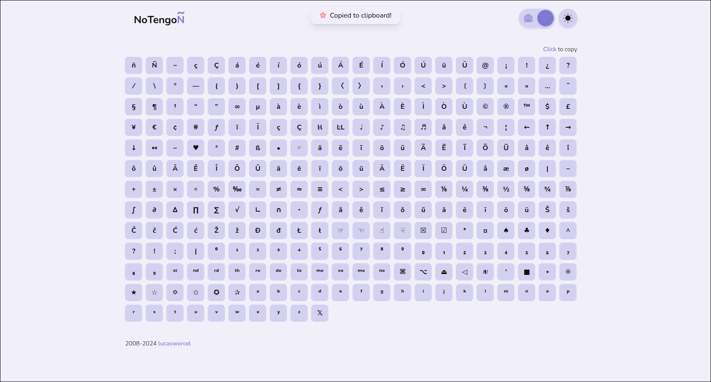
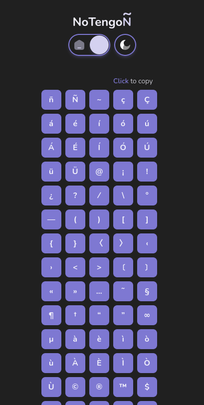

# Notengoenie - Modern and Responsive Version

Welcome to the modern and responsive version of Notengoenie! This project is a remake of the original website [www.notengoenie.com](http://www.notengoenie.com), making it easier for users with English keyboards to type special Spanish characters, such as "ñ" and accented vowels.

## Features

- **Modern Design:** Cleaner, more modern look.
- **Responsive:** Works well on mobile devices, tablets, and desktops.
- **User-Friendly:** Intuitive and easy-to-use interface.

## Screenshots

### Desktop View

### Mobile View

